# Cost Optimization and Resource Governance using AWS Budgets and Automated Cleanup

## Project Overview

This project demonstrates how to optimize AWS cloud costs by monitoring AWS spending, identifying unused resources, and automatically cleaning them up.

The solution uses AWS Budgets for cost monitoring, Amazon SNS for notifications, AWS Lambda for automation, Amazon EventBridge Scheduler for scheduled execution, and Amazon CloudWatch for logging.

The project helps reduce unnecessary AWS charges by automatically detecting unused cloud resources such as stopped EC2 instances, unattached EBS volumes, and unused Elastic IP addresses.

---

# Project Objective

Design and implement a cloud cost optimization solution that:

- Monitor AWS monthly spending using AWS Budgets.
- Send email alerts when budget thresholds are reached.
- Automatically detect unused AWS resources.
- Clean unused resources using AWS Lambda.
- Log all cleanup actions to Amazon CloudWatch.
- Automate cleanup using Amazon EventBridge Scheduler.

---

# Scenario

The Finance team observed increasing AWS bills caused by:

- Stopped EC2 Instances
- Unattached EBS Volumes
- Unused Elastic IP Addresses

Management requested an automated solution that monitors AWS costs and removes unused resources to reduce unnecessary cloud spending.

---

# AWS Services Used

- AWS Budgets
- Amazon SNS
- AWS IAM
- AWS Lambda
- Amazon EC2
- Amazon EBS
- Elastic IP
- Amazon EventBridge Scheduler
- Amazon CloudWatch
- Git
- GitHub

---

# Architecture
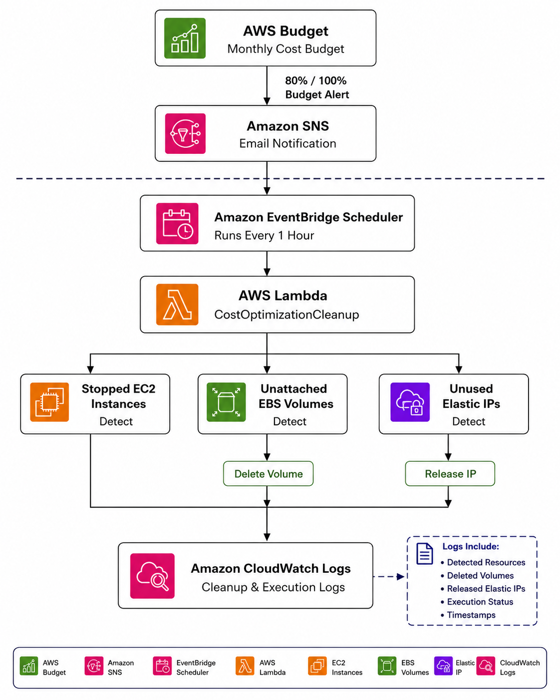

---
# Project Workflow

## Step 1 – Create IAM Role

Created an IAM Role for Lambda execution.

**Role Name**

```
Lambda-CostOptimization-Role
```

Attached Policies:

- AmazonEC2FullAccess
- CloudWatchLogsFullAccess
  
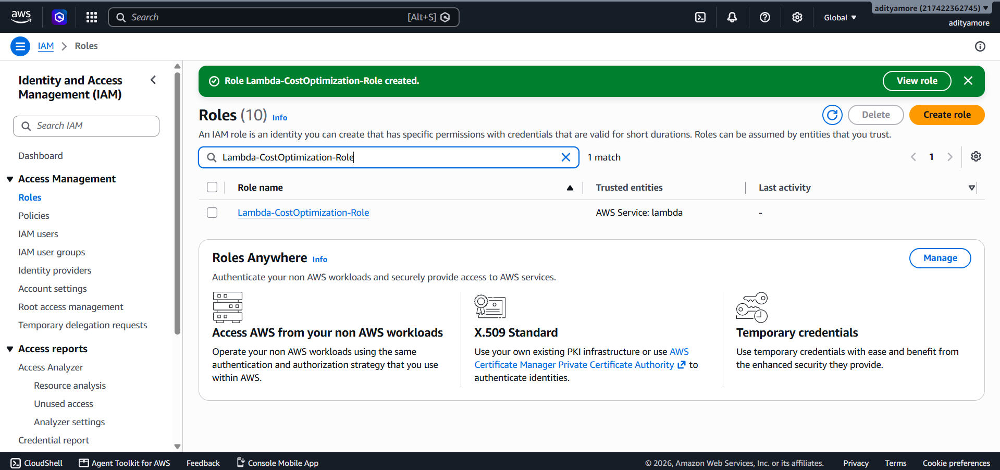

---

## Step 2 – Create Amazon SNS Topic

Created an SNS Topic for budget notifications.

**Topic Name**

```
Cost-Optimization-Alerts
```

Subscribed email address for receiving alerts.

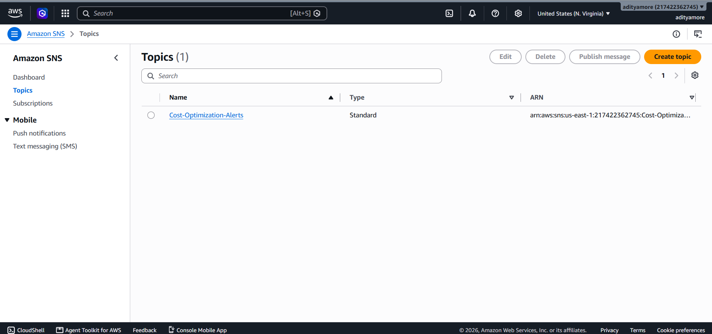

---

## Step 3 – Configure Email Subscription

Verified the email subscription successfully.

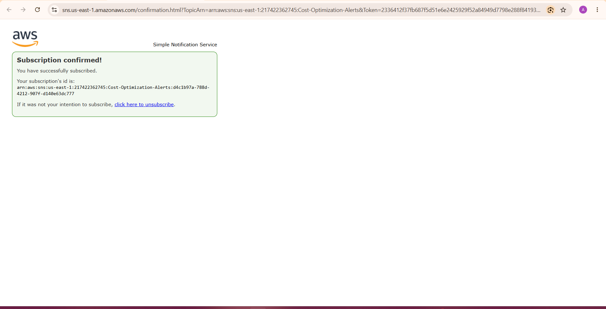

---

## Step 4 – Create AWS Budget

Created a Monthly Cost Budget.

**Budget Name**

```
Monthly-Cost-Budget
```

**Budget Amount**

```
5 USD
```

Configured Budget Alerts:

- 80%
- 100%

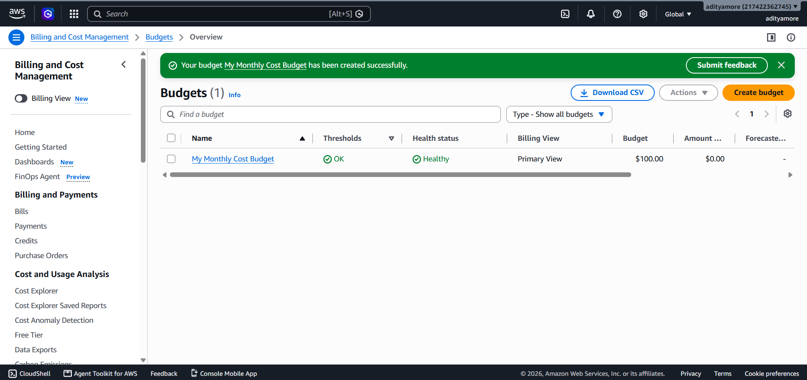

---

## Step 5 – Create Test Resources

Created:

- EC2 Instance
  
- Additional EBS Volume
  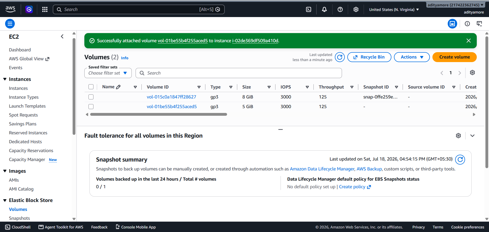
- Elastic IP
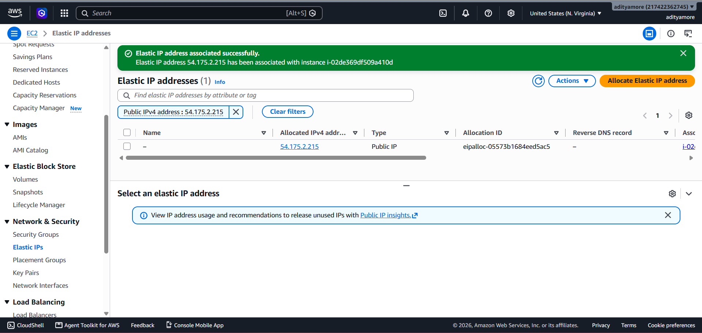

These resources were used to test automated cleanup.


---

## Step 6 – Create AWS Lambda Function

Created Lambda Function.

**Function Name**

```
CostOptimizationCleanup
```

Runtime:

```
Python 3.x
```

Execution Role:

```
Lambda-CostOptimization-Role
```
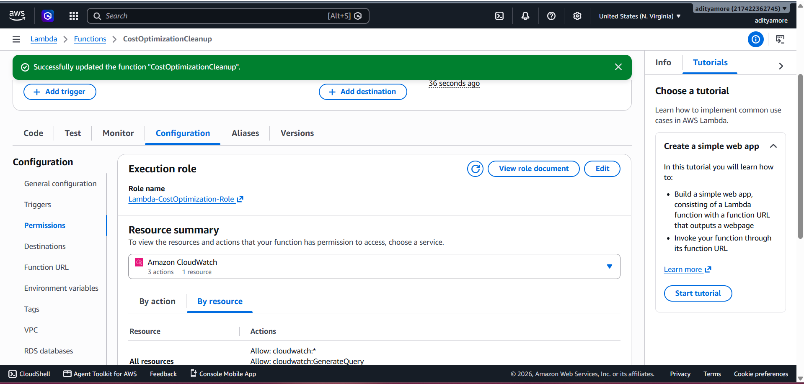

---

## Step 7 – Develop Lambda Code

Implemented Python (boto3) code to:

- Detect stopped EC2 instances
- Detect unattached EBS volumes
- Delete unattached EBS volumes
- Detect unused Elastic IP addresses
- Release unused Elastic IP addresses
- Generate CloudWatch logs
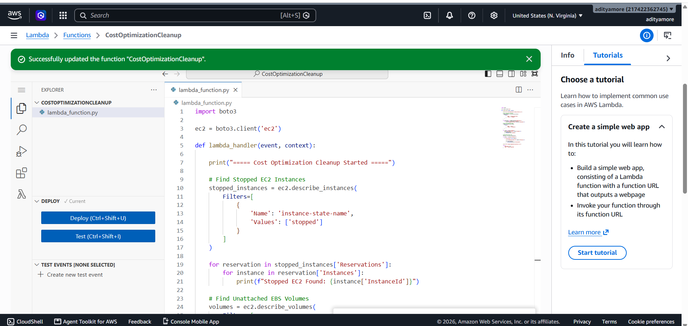

---

## Step 8 – Test Lambda Function

Successfully tested the Lambda function.

Detected:

- Stopped EC2 Instance

Generated execution logs successfully.

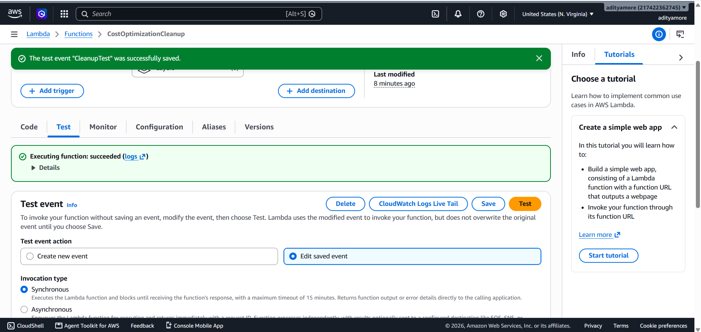

---

## Step 9 – Configure EventBridge Scheduler

Created an EventBridge Scheduler Rule.

**Schedule Name**

```
CostOptimizationCleanupSchedule
```

Execution Frequency:

```
Every 1 Hour
```

Target:

```
AWS Lambda
```
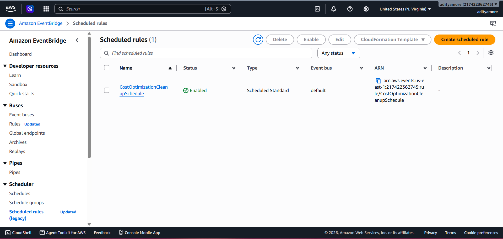

---

## Step 10 – Verify CloudWatch Logs

Verified:

- Lambda Execution
- Cleanup Logs
- Execution Report

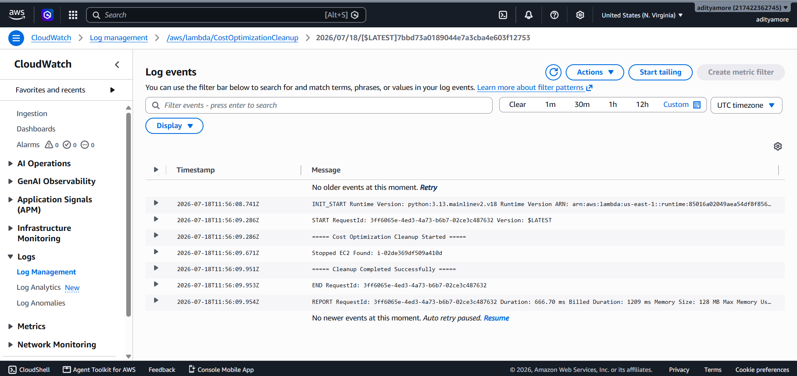

---

# Lambda Cleanup Logic

The Lambda function performs the following actions:

1. Detect stopped EC2 instances.
2. Detect unattached EBS volumes.
3. Delete unattached EBS volumes.
4. Detect unused Elastic IP addresses.
5. Release unused Elastic IP addresses.
6. Generate CloudWatch execution logs.

---

# Cost Optimization Strategy

- Monitor AWS spending continuously.
- Receive budget alerts through SNS.
- Identify unused resources automatically.
- Delete unnecessary cloud resources.
- Reduce AWS monthly costs.
- Improve cloud resource utilization.

---

# Governance Approach

This solution improves governance by:

- Automated cost monitoring
- Budget alerts
- Automatic cleanup
- Scheduled execution
- Centralized logging
- Resource optimization

---

# Project Structure

```
aws-cost-optimization-governance/
│
├── lambda/
│   └── cleanup.py
│
├── screenshots/
│   ├── step1-iam-role.png
│   ├── step2-sns-topic.png
│   ├── step3-email-subscription.png
│   ├── step4-aws-budget.png
│   ├── step5-ec2-instance.png
│   ├── step5-ebs-volume.png
│   ├── step5-elastic-ip.png
│   ├── step6-lambda-created.png
│   ├── step7-lambda-code.png
│   ├── step8-lambda-test.png
│   ├── step9-eventbridge-scheduler.png
│   └── step10-cloudwatch-logs.png
│
├── architecture.png
├── README.md
```

---

# Results

- Successfully configured AWS Budget.
- Successfully configured SNS notifications.
- Successfully created Lambda automation.
- Successfully detected unused AWS resources.
- Successfully automated resource cleanup.
- Successfully scheduled cleanup using EventBridge.
- Successfully logged execution in CloudWatch.

---

# Future Enhancements

- Integrate Slack notifications.
- Generate daily cost reports.
- Store reports in Amazon S3.
- Send reports using Amazon SES.
- Create CloudWatch dashboards.

---

# Technologies Used

- AWS Budgets
- Amazon SNS
- AWS IAM
- AWS Lambda
- Amazon EC2
- Amazon EBS
- Elastic IP
- Amazon EventBridge Scheduler
- Amazon CloudWatch
- Python (boto3)
- Git
- GitHub

---

# Author

**Aditya More**

AWS & DevOps Engineer
